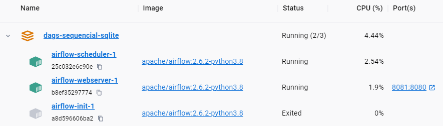

# Running Airflow in Docker with `Sequencial` Executor

Link ref:

- <https://github.com/maxcotec/Apache-Airflow/tree/main/airflow-minimal/docker-sequencial-mysql>
- <https://github.com/maxcotec/Apache-Airflow/tree/main/airflow-minimal/docker-sequencial-sqlite>

Run docker

- Option 1

```bash
docker compose up -d -f docker-compose-seq-sqlite.yaml
```

- Option 2

```bash
docker compose up -d -f docker-compose-seq-mysql.yaml
```




Accessing the web interface
Once the cluster has started up, you can log in to the web interface and begin experimenting with DAGs.

The webserver is available at: <http://localhost:8080>. The default account has the login `admin` and the password `airflow`

DAG Graph


DAG Gantt


## Cleaning-up the environment

The best way to do this is to:

- Run command in the directory you downloaded the docker-compose.yaml file

```bash
 docker compose down --volumes --remove-orphans 
```

- Remove the entire directory where you downloaded the docker-compose.yaml file

```bash
rm -rf '<DIRECTORY>'
```

- Run through this guide from the very beginning, starting by re-downloading the docker-compose.yaml file
